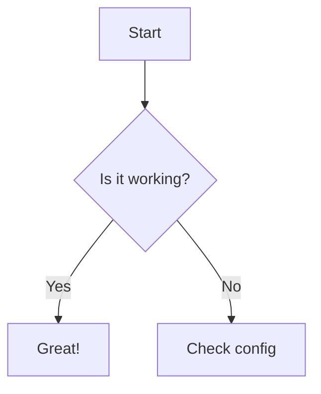

Next.js、Reactのバージョンが古くなっていたので、アップデートも兼ねてリニューアルしました。

## アップデートその1
全体デザインを変更しました。
本当はもう少しアニメーションを入れたり凝ったことがしたかったけど、公開を優先して断念。
（Figmaのすりガラス風エフェクト、いいじゃんと思って取り入れてみたらcssで再現できなかった）（SVGとかなんとか使っていつか綺麗に整えたい）

見出しやコードブロックの余白感も、読みやすくなるよう調整を重ねました。

## アップデートその2
記事にMicroCMSを使ってたところを、リポジトリ内のmarkdownファイルから記事を出力できるようにしました。ここが1番大きい改修です。

CMSを使って記事を管理できるのは良かったものの、エディター内と実際の記事の出力イメージが違って、それを細かく調整するのが少し面倒になっていました。

そんな中、markdown形式のドキュメントを仕事で扱うようになり、全てのドキュメントこれでいいじゃん…！となったので取り入れてみました。

リポジトリ内で全て完結するので、もっと手軽に書けるようになりました。これでもう少し更新スピードを上げたい。

マーメイド図も出力できるようにしています。このあたりはいつかまとめたい

## アップデートその3
スタイリング方法を`CSS Modules`から`Tailwind CSS`へ移行しました。
理由としては、Tailwind CSSを使ったことがなかったので使ってみようと思ったのと、AIが読んで調整しやすいかな？と思ったからです。

ただ、実際実装してみると、HTMLが全然スッキリしない・カスタムデザインの場合を作りたい場合は結局cssファイルを作る・そもそも調整が面倒すぎる、となかなか扱いづらかったので、近いうちに変更予定です。慣れる気がしない…

## アップデートその4
CI/CDを導入してみました。
ホスティングにVerselを使っているのでNext.jsなら自動で連携はしてくれるのですが、勉強も兼ねてあえて自動連携ではなく手動連携にしています。
typecheck、lint、build を通したうえで、mainブランチへのpushがあった場合にVercelへDeployします。

## アップデートその5
これはリニューアル中の作業の話ですが、移行バッチを作ってみました。
microCMSから以前の記事を取得し、本文をMarkdownに変換して.md ファイルへ書き出しました。
とはいえ出力した後の体裁調整は手作業で行ったため、完全な自動移行ではなく、あくまで移行作業を楽するためのツールといったものでした。

## その他
フォントも変えたけど、うぶんつフォントかわいくて戻ってきた
| ubuntu | IBM Plex Sans JP |
|------|-----|
|  |  |

